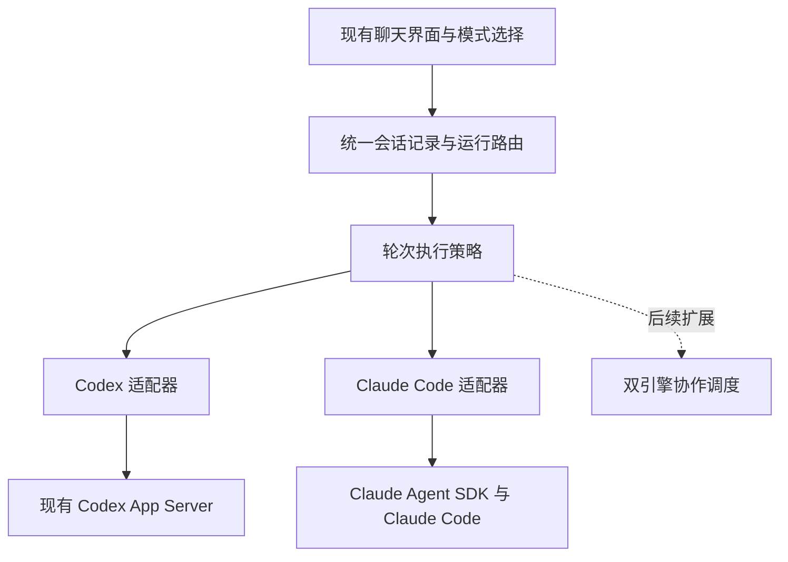

# codex.dev 同一会话多引擎模式设计

日期：2026-09-27

状态：待用户确认的设计草案；尚未修改应用代码。

## 用户需求与本次交付

在现有开发版客户端中，同一个会话拥有三种模式：

| 模式 | 本次行为 |
| --- | --- |
| Only Codex | 使用 Codex 执行当前轮次，保留已有 Codex 能力。 |
| Only Claude Code | 使用真实 Claude Code 执行当前轮次，支持连续对话、工具调用、权限确认与中断。 |
| Codex + Claude Code | 保留模式标识和扩展接口；界面显示为禁用的“后续支持”，本次不启动双引擎。 |

模式属于会话，可以在轮次之间切换。切换后仍是同一个会话、同一条可见聊天记录和同一个工作目录。每条回复标明执行引擎。不同会话可以独立选择模式并同时工作。

本次先支持这台 Mac 上的 Claude Code。现有 Codex 远程连接继续按原来的方式工作；Claude Code 的远程部署和双引擎调度留作后续功能。

## 已核实的本地条件

- 应用：`/Applications/chatgpt-dev.app`，包版本 `26.820.71523`。
- 项目：`/Users/tianyu.zhang/Documents/CodexDesktop-Rebuild`，上游为 `Haleclipse/CodexDesktop-Rebuild`。
- 项目主要包含 Electron 重打包和补丁脚本；前端及主进程是提取后的 JavaScript 产物，并无完整的原始 React 工程。
- 安装包内的主进程、通信模块和启动入口与项目中对应文件的 SHA-256 一致，已有可复用的补丁落点。
- 开发版内置 Codex CLI 为 `0.153.4-cometix`，本机 Claude Code 为 `2.1.283`。
- 现有启动脚本通过 `CODEX_CLI_PATH` 选择 Codex CLI，主进程通过 App Server 交换请求、响应和通知。
- 项目已有未提交的 `scripts/patch-model-add.js` 改动和未跟踪的 `app-initial-CX2pZp2Q.js`；实现时必须保留。

## 接入方案比较

| 方案 | 收益 | 代价 | 选择 |
| --- | --- | --- | --- |
| 在现有客户端加入会话路由与独立适配层 | 保留现有界面和 Codex 功能；只针对必要位置制作可验证的补丁；便于以后加入协作调度。 | 需要维护现有界面的协议兼容、聊天记录合并和版本检查。 | 推荐，本方案采用。 |
| 以 Omnigent 服务作为运行时，再把现有界面整体接入其会话 API | 可以复用更多多引擎编排能力。 | 增加 Python 服务、依赖和生命周期管理；仍需适配当前界面；首版改动面更大。 | 作为未来编排实现的候选，不作为首版运行时依赖。 |

参考 Omnigent 对会话、执行实例、引擎适配器的分层。首版不复制其完整平台，也不预先实现双引擎的调度策略。

## 架构

### 会话与执行实例分开

统一会话记录是跨引擎聊天历史的权威来源。两种引擎仍保存各自的原生会话状态。

| 对象 | 关键数据与职责 |
| --- | --- |
| Conversation | 稳定会话 ID、标题、模式、工作目录、宿主信息、原生会话绑定、各引擎模型设置。 |
| Turn | 一次用户请求及其执行实例列表。首版每轮只启动一个实例。 |
| AgentRun | 唯一运行 ID、引擎、原生会话/轮次 ID、生命周期状态。 |
| Event | 会话、轮次、运行和引擎标识，递增序号及消息/工具/权限/完成事件。 |
| EngineBinding | 原生会话 ID，以及该引擎已经接收的公共上下文序号。 |

模式使用明确的枚举 `codex`、`claude`、`both`，不使用只能表达二选一的布尔值。模式策略决定本轮启动哪些实例；引擎适配器负责执行单个实例。

以后启用 `both` 时，可以为一个 Turn 创建两个 AgentRun。它们的消息、工具调用、权限请求和取消操作已经有独立的归属，不需要重写历史数据模型。

### 适配器边界

两种适配器提供会话创建/恢复、开始轮次、接收流式事件、处理权限回复、中断、查询能力和关闭资源的统一接口。

- Codex 适配器保留 App Server 的双向通信。未切换过引擎的现有 Codex 会话维持原有路径和标识。
- Claude 适配器使用 Claude Agent SDK 驱动 Claude Code，沿用用户现有的合法登录方式和项目配置。SDK 版本及调用参数以本机运行时的兼容性验证为准。
- SDK 事件转换为现有界面能够显示的消息、工具调用、文件变更、权限请求和完成状态。不会以终端文本抓取作为主要通信协议。
- 引擎能力单独声明。没有等价实现的 Codex 专有功能在 Claude 模式下显示为不可用，不将其请求交给另一引擎执行。
- Only Claude Code 下的用户任务，以及需要模型执行的附属操作，均不得暗中调用 Codex。首版标题可由首条用户消息直接生成。

### 对现有客户端的改动

优先在主进程的请求路由与通知分发边界接入适配层，复用原有消息渲染、工具卡片和权限交互。前端只增加模式选择、引擎标记和能力控制等必要改动。

会话历史读取、分页、恢复和实时通知必须统一经过会话适配逻辑；不能仅拦截发送消息而继续从 Codex 历史中读取全部内容，否则 Claude 消息会在重启后丢失。

新增的维护代码放在独立模块中，由补丁脚本将入口接入编译产物。补丁必须检查目标版本和唯一匹配位置，重复运行应保持幂等；上游结构改变时明确失败。

## 模式切换与上下文交接

1. 空闲会话可以切换模式。若有执行或尚未解决的权限请求，需先结束/中断当前执行；界面和后端都阻止中途切换。
2. 切换只改变后续轮次的执行引擎，已完成的消息及其引擎归属保持不变。
3. 每个引擎优先恢复本会话已有的原生会话绑定，首次使用时再创建。
4. 接手前，根据 EngineBinding 的已消费序号生成增量上下文包，包含用户消息、公开回复、关键工具结果、文件变更信息、工作目录和未完成事项。
5. 上下文包作为明确标注的历史资料传递，不将另一引擎的输出提升为系统或开发者指令，不迁移不可访问的内部推理状态。
6. 交接记录需要持久化并可去重，反复切换和重连不会反复注入同一段历史。仅在交接被确认接收后推进已消费序号。
7. 长会话保留完整可见记录；输入长度超出目标引擎限制时，使用标明覆盖范围的摘要/近期记录和可读取的完整历史引用。交接失败或材料无法处理时显示原因，不静默丢弃上下文。

本地 Codex 版本是否支持直接注入历史，以该版本协议验证结果为准；基础交接通过适配器提交显式上下文包实现，不依赖尚未验证的实验性方法。

## 交互与持久化

- 在会话输入区域增加模式选择，与模型选择分开；模型列表和设置随引擎切换，并分别保留上次选择。
- `Codex + Claude Code` 项显示为禁用且标注“后续支持”。后端收到 `both` 请求也返回明确的未实现错误。
- 消息标明 Codex 或 Claude Code；工具调用、等待审批、取消与错误使用一致的时间线交互。
- 统一会话、执行绑定、交接序号和事件持久化到开发版独立应用数据目录。重启后恢复同一聊天记录、模式和原生会话绑定。
- 现有 Codex 会话在首次切换时建立额外映射；不批量改写或删除现有原生历史。
- 不支持的附件或操作显示具体原因，防止用户误以为已经传给引擎或成功执行。

## 权限、错误与中断

- 每个权限请求绑定到确切的运行和原生请求 ID；用户的允许/拒绝结果只返回对应引擎。
- 权限选择反映引擎实际支持的语义，不默认使用绕过权限检查的启动参数，不复用另一引擎的授权。
- 模式切换、重连或重启后，不自动重放已经执行过的写操作，也不自动批准遗留请求。
- CLI 不存在、登录不可用、工作目录无效、协议不兼容和进程异常退出都显示可处理的错误，并保留已有聊天记录。
- 中断只作用于当前运行，清理它的挂起权限请求并保留部分输出；确认运行结束后才允许切换。

## 双引擎模式预留

本次保留模式、执行策略接口、每轮多个运行的数据结构、事件来源标记和独立取消/审批能力。

未来需要单独设计并实现：两引擎是并行解题还是分工协作、结果如何汇总、如何互相发送消息、工作树或文件写入如何隔离、如何避免重复执行，以及预算和失败处理。首版不承诺任一协作策略，也不允许两个引擎无调度地同时写同一工作目录。

## 实施顺序与验收

1. 在独立开发目录中保留当前安装包与已有本地补丁，固定前端和两个运行时的版本基线。
2. 验证 Codex 原始协议透传，以及 Claude Code 的流式输出、权限往返、中断和恢复；据此确定最小兼容接口。
3. 实现统一会话存储、引擎适配器、单引擎执行策略和历史交接，再接入前端。
4. 制作可重复应用的补丁与本机可运行构建，完成集成验证后交付可回退版本。

验收覆盖：

- Only Codex 的现有聊天、工具调用、权限确认、中断和继续保持正常。
- Only Claude Code 可在测试工作目录中读取、修改文件和运行命令，流式过程在界面可见；拒绝权限后对应动作未执行。
- 用同一个会话完成 Codex → Claude Code → Codex：接手引擎能使用前面明确给出的事实及文件变更，历史不重复，侧栏不产生额外聊天。
- 关闭并重新打开应用后，两种引擎消息、模式和会话绑定均能恢复。
- 执行期间切换被阻止；中断完成后可以切换，不遗留后台执行或失去归属的审批。
- 不同会话采用不同模式时，事件和权限请求不串线。
- 对单引擎模式检查真实运行轨迹：每轮只有选中的引擎产生模型执行；`both` 不会启动任何协作任务。
- 用合成的双运行事件验证标识与存储不会冲突；这不等同于已实现真实双引擎运行。
- 补丁可重复应用；不匹配的上游版本失败可见；打包版本能启动并通过上述主要用户路径。

## 参考

- [Omnigent 项目](https://github.com/omnigent-ai/omnigent)：同一会话中管理不同引擎的产品方向。
- [Omnigent Harness Plugin Interface](https://github.com/omnigent-ai/omnigent/blob/main/designs/harness-plugin-interface.md)：引擎注册与运行模块分离。
- [OpenAI App Server 文档](https://developers.openai.com/codex/app-server/)：线程、轮次、流式事件与双向权限请求。
- [Claude Agent SDK](https://github.com/anthropics/claude-agent-sdk-typescript)：程序化驱动 Claude Code 的官方入口。
