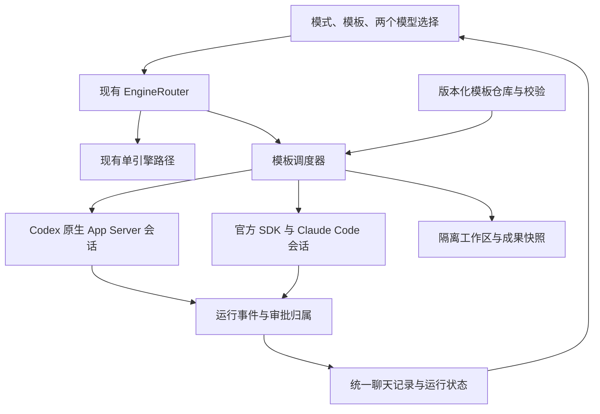

# Codex + Claude Code：Polly、Debby 与自定义模板

日期：2026-09-27

状态：设计草案，待用户审阅；本文件不代表功能已实现或安装。

## 需求与交付边界

用户要求同一聊天支持 Only Codex、Only Claude Code、Codex + Claude Code；双引擎模式参考 Omnigent 的协作逻辑，同时显示 Codex 和 Claude 的独立模型选择。用户已明确选择同时支持 Polly、Debby 和自定义模板。

本设计启用本地聊天的双引擎模式，完整覆盖以下三个入口：

| 模板 | 交付行为 |
| --- | --- |
| Polly · 协作开发 | 拆解任务，独立任务并行执行，使用另一引擎审查固定版本的成果，再整合交付。 |
| Debby · 双方讨论 | 两个引擎独立回答，可加入多轮交叉评论，展示双方观点和汇总。 |
| 自定义 | 新建、复制、编辑、导入和导出模板，配置角色、提示词、步骤依赖、并行、互评、轮数与输出格式。 |

三种模式可以在轮次之间切换，保留同一聊天及公共上下文。运行中的模板和模型配置冻结。

远程 Claude 的底层调用已在多个集群验证，但远程应用网关尚未实现。本设计不将这些探测结果当作远程双引擎已经可用。远程界面以对应主机的能力握手为准；后续复用远程设计，将调度器和两个原生 harness 一起运行在集群，Mac 只承载控制和显示，不默认转发 Mac 的模型 API。

## 架构选择与 Omnigent 复用范围

推荐在现有 JavaScript 网关内增加模板调度器，保留现有两个原生引擎适配器。

| 路线 | 优点 | 代价与判断 |
| --- | --- | --- |
| 适配 Omnigent 模板与调度规则，沿用现有网关 | 保留现有登录、模型目录、权限交互和聊天协议；部署沿用当前应用运行时。 | 需要实现和测试调度状态机；自定义模板使用本应用声明式格式。推荐。 |
| 将完整 Omnigent 作为独立服务 | 能覆盖更多上游 YAML、工具与插件能力。 | 新增 Python 3.12+、服务、存储和依赖；仍需适配界面和权限。适合以后明确要求完整上游模板兼容时引入。 |
| 通过 Omnigent 扩展接口调用现有适配器 | 可以兼顾部分上游运行时与当前 harness。 | 同时维护 Python 服务和跨进程适配器，当前收益不足以抵消复杂度。 |

已核实参考版本：`omnigent-ai/omnigent@56c6a7f73024a257a5d359378e8ebb68a66dde7f`。主要依据：

- `examples/polly/config.yaml`：协调、异步分发、不同厂商审查、固定 diff 与验收合同。
- `examples/debby/config.yaml` 及 `examples/debby/skills/debate/SKILL.md`：独立回答、上一轮交叉评论、汇总和保留分歧。
- `docs/AGENT_YAML_SPEC.md`：角色、指令、harness、工具和子代理的声明方式。
- `omnigent/inner/codex_executor.py`：底层使用 `codex app-server`，但其线程启动参数包含 `approvalPolicy: never`。
- `omnigent/inner/claude_sdk_executor.py`：使用官方 Claude SDK，同时有自己的系统提示、工具集合与会话管理。

这些差异说明完整引入运行时仍需要行为适配。这里复用模板的角色职责、提示词中相关段落和执行规则；调度、事件及持久化实现适配当前应用。复制或改编的素材保留 Apache 2.0 许可证、来源、上游 revision 和修改说明。

**自定义模板兼容范围：**支持下文定义的应用 YAML/JSON 格式，不声称可以直接运行任意 Omnigent agent bundle。上游 Python function、任意新 harness、容器、定时器及完整插件系统不属于本版。导入上游 `config.yaml` 时给出格式说明，不能静默丢字段后声称导入成功。若用户需要这些完整上游能力，应改选完整服务路线。

## 界面行为

现有模式选择启用 `Codex + Claude Code`。选择后，在同一模型设置区域同时显示：

1. 模板：`Polly · 协作开发`、`Debby · 双方讨论`、用户模板以及“管理模板”。初次进入默认 Polly。
2. Codex 模型：沿用原生 Codex 模型选择和适用的 reasoning effort 设置。
3. Claude Code 模型：沿用当前提供方 API 目录，显示具体版本及真实模型 ID。
4. 模板参数：Debby 的讨论开关和轮数，以及自定义模板声明的参数。

窄窗口允许控件换行，两个模型选择都保持可见、有独立标签并可用键盘操作。模型目录刷新不会清除已经选择的模型，也不会把两个选择合成一个全局模型值。

模板管理提供名称、描述、角色和参数的表单编辑，以及高级 YAML 编辑；新建和复制内置模板都受同一个 schema 校验。内置模板只读，修改时另存为用户模板。导入仅解析、验证和保存，不运行任务。

聊天中一次用户输入对应一个可见轮次，内部按角色显示可展开的运行条目：任务名称、引擎、请求模型、实际模型（harness 有返回时）、阶段和状态。提供方未报告实际模型时保留“实际模型未知”，不把请求值当作已验证值。消息和工具事件附带来源；最终汇总保留原始结果入口。内部工作会话不在侧边栏生成一批用户聊天。

运行或待审批时，禁用当前聊天的模式、模板及模型修改；其他聊天不受影响。可停止整个轮次或停止一个角色。单角色停止后，依赖它的步骤进入待处理状态，允许重试该角色或结束本轮并保留部分结果。

## 模型与 harness 绑定

模型按引擎保存：`models.codex` 与 `models.claude`。每轮启动时生成不可变的执行配置，包含模板版本、参数、两个模型值和各引擎适用的设置。

- 所有 `engine: codex` 的角色都使用用户选择的 Codex 模型。
- 所有 `engine: claude` 的角色都使用用户选择的 Claude 模型。
- Polly、Debby 的协调/汇总角色默认使用 Claude，因此也使用同一个 Claude 模型选择；界面模板说明明确这一点。自定义模板可将协调角色指定为 Codex。
- 协调角色有自己的会话，但没有隐藏的第三个模型槽。它负责计划和汇总，不作为 Debby 的第三个独立观点。
- 模板、协调器或自动模型建议不得覆写用户选择，也不得将 Codex 角色转换成 Claude 角色。模型错误明确报给该角色，不跨引擎降级。
- `default` 等显式默认项仍代表跟随对应引擎配置。选择具体版本则原样传给该 harness；目录暂时不可用不等于已选模型无效，提供方实际拒绝需正常报错。
- Codex 继续使用原生 `codex app-server`、原生工具和配置。工作角色各自拥有内部 Codex thread，避免并行任务污染可见聊天的原生 thread。
- Claude 继续使用官方 JS Agent SDK 启动 Claude Code，保留 `claude_code` preset、原生工具循环、会话恢复及当前提供方环境解析；角色指令作为附加指令，不能替换成裸模型 API 调用。
- 审查/讨论角色可以限制工具能力，这不改变其 harness。角色限制必须落实到 SDK、App Server 和现有审批机制；仅靠提示词约束不能被报告为强制只读。

Codex 和 Claude 各自解析凭据。公共历史、模板、诊断和运行记录不保存凭据；不能用模型名推断应借用另一引擎的认证。

## Polly 执行合同

1. **准备。** 确认两个 harness 可启动，冻结模型和工作区基线。Polly 的写入流程要求 Git 工作区；非 Git 项目可以使用 Debby/只读自定义模板。缺少 Git 时不擅自初始化仓库。
2. **拆解。** 协调角色生成受 schema 校验的任务图，每项包含稳定 ID、任务说明、引擎、`implement/review/explore`、依赖、预计文件范围和验收条件。它不直接改源代码。模型返回的任务图不是 shell 脚本，不执行任意字符串。
3. **分发。** 就绪且独立的任务并行执行，默认最多两个原生运行同时活跃。存在共同写入范围或依赖的任务顺序执行。任务数默认上限 8，修复/重审最多 2 轮；达到上限保留结果并显示未完成项，用户可继续。
4. **隔离。** 每个实现任务使用应用拥有的独立 worktree，依赖已完成任务时以其确定的成果为起点。开始时用私有 Git index/object 保存当前项目快照，包含已有已跟踪修改和未忽略的新文件；不 stash、不改变用户 index，也不将任务错误地放在丢失用户修改的 HEAD 上。忽略文件与依赖按项目已有准备方式处理；准备失败单独报错。
5. **固定成果。** 实现完成后保存 base/head、包含二进制变更的 diff 文件、内容哈希、验收条件和实际验证结果。审查对象被冻结，不跟随实现者随后产生的修改。
6. **交叉审查。** Codex 实现交给 Claude 审查，Claude 实现交给 Codex 审查。审查者获得固定 diff、可读的对应基线/结果快照和验收合同，不进入可变的实现 worktree；禁止修改项目。出现问题则交回原实现角色修复，并为新快照重新审查。
7. **整合与验证。** 通过审查的任务按依赖顺序进入独立整合 worktree，运行项目相关检查。冲突作为新的有限修复任务处理，结果再次交叉审查。汇总区分实现完成、审查通过、验证通过和未完成项。
8. **交付。** 对用户请求实施的修改，将通过验证的整合差异应用到原项目，界面提供完整 diff；沿用已有任务授权和引擎权限，不新增逐次确认步骤。应用时核对目标文件与启动基线，并保留用户 index 状态；目标已变化时保留成果并进入冲突处理，不覆盖用户更新。用户仅要求方案或审查时只交付相应结果。默认不 push、不创建 PR、不合并远程分支。

只有一个实现任务时，两个引擎仍分别承担实现和审查；不能为了显示并行而让它们同时修改同一个目录。子任务结束通过事件触发后续调度，无模型轮询循环。worktree 和 diff 保存到可恢复的任务目录，不能在失败或停止后自动删除未交付成果。

## Debby 执行合同

1. **独立回答。** 同一请求和同一份公共历史快照分别发给 Codex 与 Claude，并行产生第 0 轮答案。输入不包含另一方本轮输出。原生角色会话在同一模板版本的后续轮次中各自恢复。
2. **默认展示。** 默认不开讨论：显示两个独立答案及协调角色的共识/分歧汇总。
3. **交叉评论。** 开启讨论默认 1 轮，界面可设置 1–5 轮。第 N 轮双方都只拿到对方第 N−1 轮的完整答案，各自评论并修订，二者并行；必须等这一轮两方都完成再进入下一轮。自定义有界循环最多允许 10 轮。
4. **汇总。** 展示双方最终答案及共同点、变化和仍存在的分歧。汇总角色不能伪造某方观点或把失败的一方视为赞同。显式轮数执行完毕；用户可以提前停止，首版不靠模型自行判断收敛来改变轮数。
5. **能力与失败。** 内置 Debby 为讨论及参考文件阅读用途，禁止项目写入。用户需要开发工作时切换 Polly 或写入型自定义模板。某方失败时保留另一方结果，暂停后续讨论；支持针对失败方的重试。用户结束部分结果时明确标出缺失观点。

## 自定义模板格式与生命周期

模板是声明式数据，使用同一个调度器执行，不能仅保存一段总提示词后仍固定运行 Polly。

| 字段 | 含义与约束 |
| --- | --- |
| `schemaVersion` / `id` / `revision` | schema 版本、稳定标识和保存版本。用户模板每次保存产生新 revision。 |
| `name` / `description` | 菜单名称和用途说明。 |
| `roles` | 命名角色，声明 `engine: codex\|claude`、提示词、工具权限范围、会话复用方式。 |
| `parameters` | 带类型、默认值与边界的可编辑参数，例如讨论轮数。 |
| `steps` | 有向无环依赖图；各步骤声明角色及输入来源。 |
| `limits` | 最大并发 1–4、最大动态任务数 1–32、最大循环次数 0–10；默认并发 2。 |
| `output` | 需要展示的步骤、汇总角色及格式要求。 |

步骤原语包括 `run`（单角色）、`parallel`（并行子步骤）、`planTasks`（受约束任务图）、`executeTasks`（执行生成的任务）、`crossReview`（另一引擎审查）、`repeat`（有界循环）、`synthesize`（汇总）。结果使用显式引用，例如 `answers.codex`、`previousRound.claude`；输入只能引用已完成依赖或上一轮结果。`synthesize` 本质也是有来源约束的角色运行。

新建时提供空白双引擎模板和内置模板副本。高级编辑可组合上述原语，例如“Claude 规划 → Codex 实现 → Claude 审查”或“双方各提方案 → 双方各评论两轮 → Codex 汇总”。自定义模式也至少包含一个可达的 Codex 步骤和一个 Claude 步骤。

保存/导入验证包括未知字段、模型槽归属、重复 ID、悬空依赖、非循环步骤中的环、轮数/并发上限、双引擎可达性、跨引擎审查合同和输出引用。无效模板不能替换已有有效版本，错误定位到字段/步骤；YAML 不解析自定义可执行 tag。模板本身不能覆盖进程环境、凭据、harness 路径或应用审批政策。

模板不自行注册新工具进程；角色可使用相应 harness 已配置且允许的原生/MCP 工具，实际调用仍走该引擎的权限机制。能力限制取模板约束与用户/项目配置的交集，模板无法授予额外权限。

模板文件保存于应用独立的 `engine-templates` 目录。每轮保存完整模板快照与哈希；正在运行或已完成的轮次不受模板编辑、删除和内置模板升级影响。运行中可以保存新模板版本，但应用到当前聊天要等轮次结束。删除模板不删除历史中的运行快照。

## 组件与协议

新增模块按职责分开，避免继续将所有逻辑放进 `router.mjs`：

- `templates/`：内置素材、schema、版本存储、导入导出和校验；不启动模型。
- `orchestration/`：依赖调度、模板解释、输入快照、运行状态和完成条件；通过适配器接口工作。
- `workspaces/`：Git 快照、独立 worktree、固定 diff、整合和安全应用；不决定角色或模型。
- 原生适配器：启动/恢复角色、流式事件、审批、中断和回收；单引擎调用保留当前默认行为。
- 前端补丁：选择器、模板编辑、运行来源和分组状态；不在前端执行调度。

统一模式用 `mode: codex|claude|both`；单个角色的 `engine` 仍严格限于 `codex|claude`，分别校验，不能把 `both` 当作第三个 harness。

一次 `turn/start` 原子捕获 `engineMode`、`engineModels: {codex, claude}`、Codex 参数以及 `template: {id, revision, parameters}`。旧 `engineModel` 继续只作为单 Claude 模式兼容字段；路由器在发给原生 App Server 前移除所有扩展字段。新聊天、预热 thread、现有聊天、重开应用都必须使用同一快照规则，不能在创建完成后用默认值覆盖用户选择。

增加 `engine/templates/list|read|save|delete|import|export`、`engine/runs/read|interrupt|retry`；扩展 `engine/capabilities` 返回模板/调度版本、当前主机的 `bothAvailable` 和限制原因。查询以 host ID、工作区和配置作用域缓存。保留旧 `engine/turns/read`，为双引擎返回明确来源和运行映射，旧记录默认保持 Codex 标签。

## 存储、上下文和生命周期

存储升级为 schema v2，迁移前保留 v1 备份，原子写入；旧运行不会重新执行。v2 不直接交给旧运行时读取，回退安装需同时恢复匹配的存储备份，保留新历史归档。

- 每个聊天仍最多一个活跃用户轮次，内部可有多个角色运行。用 `activeTurn` 代替仅能表示单引擎的 `activeRun`。
- 每个 Turn 保存输入、配置快照、模板快照、步骤和 `runs[]`。每个 Run 保存 `runId`、角色/引擎、步骤/轮数、原生 session/turn ID、尝试次数、状态、请求/报告模型、工作区、成果引用和上下文游标。
- 每条事件携带 host/conversation/turn/run/role/engine、独立事件 ID、运行内序号和聊天内持久序号。持久化后再展示；重连去重，迟到事件不能完成另一个运行。
- 单引擎 bindings 继续保留；双引擎 bindings 另以模板 revision、角色、工作区和会话用途区分。Debby 角色可跨用户轮次恢复，Polly 实现/审查绑定到具体任务及成果。换模板版本创建新的角色 bindings，但公共历史延续。
- 模式切换仅交接公共消息、公开工具结果和可用成果，不复制隐藏推理。原生游标在输入被确认接收后推进；失败于发送前不会把上下文标成已消费。同一输入重试不重复追加用户消息。
- 单引擎回切获得按角色标注的公开结果与汇总。单引擎原生历史合并不能把双引擎内部线程错误导入成额外用户轮次。

审批 ID 由网关映射到准确的 host/turn/run/native request，卡片展示引擎、角色、工作区与动作。审批一方不能放行另一方；停止、完成、进程重启后，旧回复不能批准新的工具请求。

状态至少区分准备、排队、执行、待审批、成功、失败、取消和依赖未满足。单个失败不丢弃其他成果，也不把整轮标为成功。重试创建新 attempt，仅重新执行选定失败角色；已有成功步骤不会自动重跑。

停止整轮先冻结调度，再取消所有活跃角色和待审批，等自有进程停止后才解除忙碌状态，保留已经产生的输出和文件。不能只中断协调角色而遗留工作进程。

渲染窗口刷新且网关仍存活时，按持久游标恢复展示，不重复启动任务。本地应用退出时关闭所属运行；网关异常退出后重启将未完成运行标为 interrupted，核对进程身份并清理已失去所有者的子进程。不能把旧 PID 盲目当成当前自有进程，也不能自动重放可能已经产生文件写入的步骤。继续执行由用户启动新的 attempt。远程断线后继续运行的语义随远程网关实现另行验收。

当前 Claude 适配器支持的输入类型是文本、mention、skill。双引擎首次交付采用两边已验证能力的交集；发送前报告不支持的附件，不能把图片/文件静默丢给其中一方。文件路径与上下文引用以项目所在 host 为准。

## 验证与完成条件

| 层面 | 必须证明的结果 |
| --- | --- |
| UI | 两个真实目录同时可选；分别修改后请求值互不覆盖；新聊天/预热/已有聊天/重启保持模型和模板。 |
| 模型/harness | 使用两个不同的明确模型 ID，记录实际原生进程和请求；Codex 走 App Server、Claude 走 Claude Code；协调/子角色不出现隐藏模型或跨引擎替换。 |
| Debby | 两边启动重叠；第 0 轮相互独立；第 N 轮仅输入对方 N−1 结果；0、1、多轮与一方失败结果正确。 |
| Polly | 独立任务各自 worktree；现有修改保留；依赖按序；审查者不同引擎且读取固定 diff；整合检查、冲突和应用时基线保护有效。 |
| 自定义 | 表单/高级编辑和导入导出往返；自定义步骤实际改变执行顺序；未知字段、循环、越界参数和失效引用拒绝；旧运行仍可读取其模板版本。 |
| 权限/停止 | 两个并发审批可分别允许/拒绝；旧审批不能串用；单角色停止与整轮停止均无继续写入的遗留进程。 |
| 持久化 | v1 迁移保留历史；双方输出交错时不丢失；重连不重复消息/运行；进程退出中断恢复；模式切换公共历史完整。 |
| 回归 | 当前单 Codex、单 Claude、具体版本模型列表和原生远程 Codex保持可用。远程未就绪时双引擎不误报可用。 |

先做可控假适配器的调度、模型归属和故障测试，再用两个真实 harness 在一次性 Git 项目运行 Debby、Polly 和一个自定义模板。写入、拒绝、取消验证实际文件与进程结果，不能只断言 UI 显示成功。

构建沿用版本锚点检查、独立依赖目录、ASAR 校验和签名验证，不在仓库根目录安装依赖。预览应用完成 GUI 验证后才进入现有备份/安装流程；安装后复核运行文件哈希和实际界面。当前阶段只提交设计，不修改已安装应用。

## 实现分段

1. 先核实两个原生 harness 的多会话、角色工具限制和模型绑定能力，再实现模板 schema/仓库、v2 存储与模型请求快照；能力缺口需在适配器补齐，不能用提示词假装实现隔离。
2. 多运行适配器、审批归属、调度状态机与恢复。
3. Debby 和通用自定义步骤，接入两个模型选择及模板管理。
4. Polly 的任务图、工作区、交叉审查、整合及成果交付。
5. 故障回归、真实 harness 验证、预览 GUI 与安装验证。

这些是同一次双引擎功能交付的实现分段。仅完成 Debby 或只出现两个下拉框，不算满足用户已选定的 Polly + Debby + 自定义模板需求。
